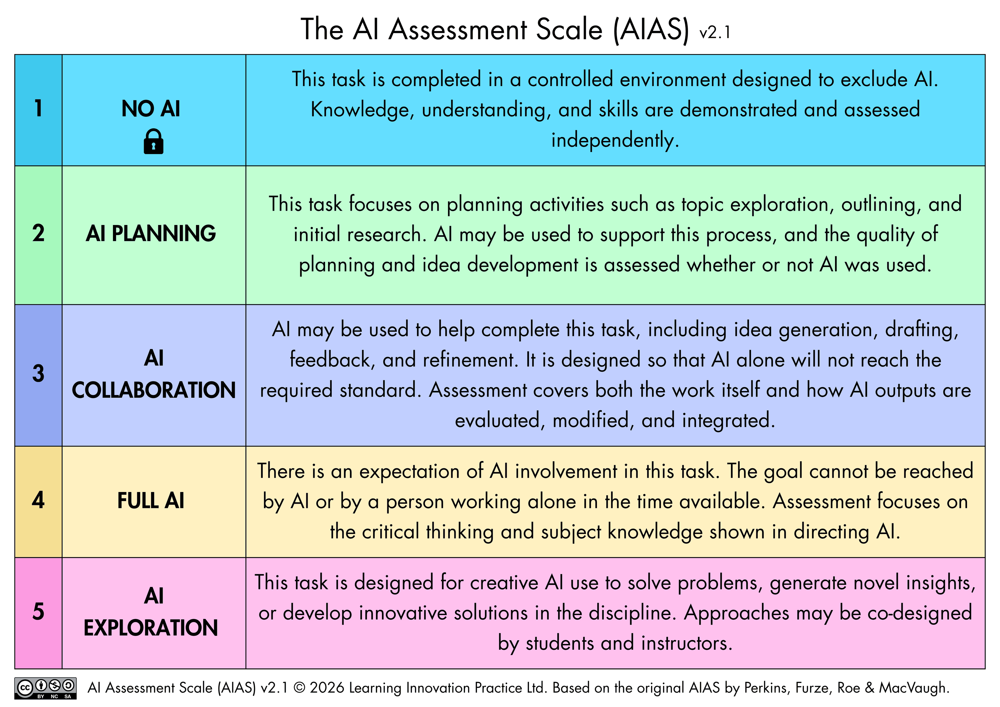

# General Policies on AI and LLM usage

Program policies on AI and LLM usage will vary slightly course by course. While
Boston University (BU) has an overarching set of guidelines for student usage of
AI (https://www.bu.edu/aida/guidelines/), specific policies are set by each
instructor.

As a general rule, the BU Bioinformatics Program has adopted and integrated
instructor and student usage of LLMs in a thoughtful and responsible way. We
have done this with the following ideas in mind:

1. AI and LLMs are tools, not a replacement for critical thinking and
problem-solving, and should be used to complement your learning
2. Industry and companies are beginning to view LLM usage as an integral skill
3. Transparency and attribution are as important as they have always been

In practice, this is what the AIAS scale means for our program:

| Level | What it means in practice | Claude Chatbot | Claude code |
| --- | --- | --- | --- |
| 1 | No AI use even for brainstorming. We are interested in your thoughts and words. | ✗ | ✗ |
| 2 | You can use AI for brainstorming and organizing your thoughts, but no content should leave your chat | No copy and paste | ✗ |
| 3 | You can use AI for brainstorming and organizing your thoughts, and you may copy and paste output with attribution  | Copy and paste | ✗ |
| 4 | AI can author content, you should attempt to structure and guide the LLM with appropriate documentation | ✓ | ✓ |
| 5 | AI can author content with minimal guidance or supervision | ✓ | ✓ |

Just a note that you are always responsible for the content you produce no matter the 
level of involvement from AI or LLMs. You should always critically review and evaluate
any output that it creates. 

This is the original the AI Assessment Scale (Perkins, Furze, Roe & MacVaugh 2026).
You can see a representative table of this framework below:

Many of your classes will define specific sections of each assignment with their
expectations of your LLM usage. For some portions, we want to hear and evaluate
your thoughts and work rather than those produced by an LLM. For other parts, we
are hoping to see how you can best direct LLMs to accomplish a goal with all of
the standards and rigor expected in science.

What this means:

## From the instructors

- We will be openly transparent about any AI usage in our own materials. Each
course will handle this slightly differently, but you can expect to find AI
usage attributions and attestations noting if LLMs were used in the generation
of any course materials, and how.
- We make extensive use of the AI Assessment Scale to delineate our expectations
for your interaction with LLMs in your coursework. We have tried to give you
ample opportunities to both utilize LLMs to their full potential and exercise
your own personal critical thinking to help you best develop as a scientist.
- We have no intention of attempting to track your usage of LLMs outside of our
guidelines.

## From you

- We hope that our model of transparency and attribution encourages you to do
the same for your own usage of LLMs.
- Engage honestly with our expectations under the AI Assessment Scale to help
you best develop the skills you will need further on in your career.
